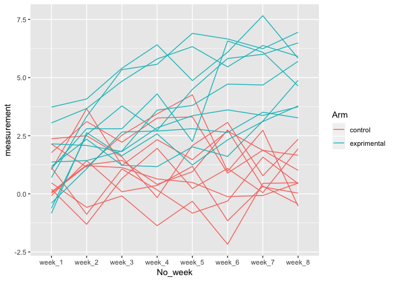

hw5
================
Shan Jiang
11/2/2018

``` r
library(tidyverse)
```

    ## ── Attaching packages ────────────────────────────────────── tidyverse 1.2.1 ──

    ## ✔ ggplot2 3.0.0     ✔ purrr   0.2.5
    ## ✔ tibble  1.4.2     ✔ dplyr   0.7.6
    ## ✔ tidyr   0.8.1     ✔ stringr 1.3.1
    ## ✔ readr   1.1.1     ✔ forcats 0.3.0

    ## ── Conflicts ───────────────────────────────────────── tidyverse_conflicts() ──
    ## ✖ dplyr::filter() masks stats::filter()
    ## ✖ dplyr::lag()    masks stats::lag()

``` r
library(rvest)
```

    ## Loading required package: xml2

    ## 
    ## Attaching package: 'rvest'

    ## The following object is masked from 'package:purrr':
    ## 
    ##     pluck

    ## The following object is masked from 'package:readr':
    ## 
    ##     guess_encoding

``` r
library(ggplot2)

set.seed(1)
```

## Problem 1

##### Inspecting the file path and file names in the zip.

``` r
file_path <- "./data/"
length(list.files(file_path))  # How many files are there?
```

    ## [1] 20

``` r
list.files(file_path)  # Show all names
```

    ##  [1] "con_01.csv" "con_02.csv" "con_03.csv" "con_04.csv" "con_05.csv"
    ##  [6] "con_06.csv" "con_07.csv" "con_08.csv" "con_09.csv" "con_10.csv"
    ## [11] "exp_01.csv" "exp_02.csv" "exp_03.csv" "exp_04.csv" "exp_05.csv"
    ## [16] "exp_06.csv" "exp_07.csv" "exp_08.csv" "exp_09.csv" "exp_10.csv"

``` r
list.files(file_path)[11:20]  # Show last 10 names
```

    ##  [1] "exp_01.csv" "exp_02.csv" "exp_03.csv" "exp_04.csv" "exp_05.csv"
    ##  [6] "exp_06.csv" "exp_07.csv" "exp_08.csv" "exp_09.csv" "exp_10.csv"

Create a tidy dataframe containing data from all participants, including
the subject ID, arm, and observations over time.

### Construct a dataframe using the `list.files` function

``` r
## Construct a function to read the csv file
read_sheet <- function(path) {
   df = readr::read_csv(path) %>% 
   janitor::clean_names()
   
   df
}

## Construct the path 

base = "./data/"
p = list.files(file_path)
vec_name = str_c(base, c(p))

control_df = map_df(vec_name, read_sheet)
```

  - Tidy the result: file names include the subject ID and arm.

<!-- end list -->

``` r
# Calling the ifelse function within mutate to label 2 Arms
control_df = control_df %>% 
  mutate(ID = 1:20) %>% 
  mutate(Arm = ifelse(ID < 11, yes = "control", no = "exprimental")) %>%  
  select(Arm, ID, week_1:week_8) %>% 
  gather(key = No_week, value = measurement, week_1:week_8)
```

### Spaghetti plot

``` r
control_df %>% 
ggplot(aes(x = No_week, y = measurement, group = ID)) +
  geom_line(aes(color = Arm)) + 
  facet_wrap(~ID) +
 theme(text = element_text(size = 9),
        axis.text.x = element_text(angle=90, hjust=1)) 
```

<!-- -->

##### Comment on differences between groups.

From the above faceting Graph, we showed the absolute value of
measurement and the gap of the two groups.

1.  On averge, subjects in the Experimental group attains a higher
    measurement value than that of subjects in control group from week 1
    to 8.
2.  The experimental group presents a trend of increase across the
    weeks, which may indicates the exposure’s potential effect on the
    patients with the effect of time.
3.  The control group patients acquired a more stable measurement in its
    outcome value, so it may indicates a lack of effect of exposure.

## Problem 2

### Import the raw data.

``` r
require(RCurl)
```

    ## Loading required package: RCurl

    ## Loading required package: bitops

    ## 
    ## Attaching package: 'RCurl'

    ## The following object is masked from 'package:tidyr':
    ## 
    ##     complete

``` r
homicide_raw = read.csv( text = getURL("https://raw.githubusercontent.com/washingtonpost/data-homicides/master/homicide-data.csv"))
```

### Describe the raw data

The raw data focus on the homicide topic, which is originated from
Washington Post github page. It organizes a total of 52179 cases from
the year of 2007 to 2015, containing 12 variables ranging from the
demographical variables of the id, name, gender, age and race of the
victim to the geographical and time information of the case.

``` r
homicide_raw = homicide_raw %>% 
  mutate(city_state = str_c(city, state, sep = "," )) %>% 
  mutate(city_state = as.factor(city_state))
```

  - The total number of homicides grouped by cities.

<!-- end list -->

``` r
total_n  = homicide_raw %>% 
  group_by(city_state) %>% 
  summarize(n = n())
```

  - The number of unsolved homicides grouped by cities.

<!-- end list -->

``` r
unsolved_n  = homicide_raw %>% 
  group_by(city_state) %>%
  filter(disposition %in% c("Closed without arrest", "Open/No arrest")) %>% 
  summarize(n = n())
```

  - Use the `prop.test` function to estimate the proportion of homicides
    that are unsolved; save the output of prop.test as an R object.
